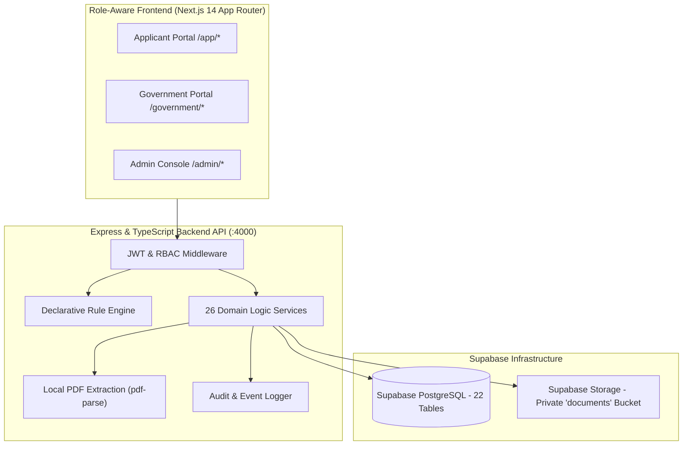

# Project Documentation — Udyog Setu
## Unified Industrial Approval & Compliance Intelligence Platform

**SIH 2026 · Problem Statement ID: 26130**
**Organization:** Government of Maharashtra
**Category:** Software · **Theme:** Miscellaneous

---

## 1. Executive Summary

**Udyog Setu** is a full-stack, production-ready Single Window Approval and Compliance Intelligence Platform developed for **SIH 2026 Problem Statement 26130** (Government of Maharashtra). It addresses the end-to-end regulatory lifecycle of an industrial entrepreneur — from initial discovery of required statutory permissions to obtaining clearances, managing ongoing post-approval compliance, and discovering government fiscal incentives — all through a unified, role-aware digital workspace.

The platform is designed under the **Maharashtra Industry, Trade and Investment Facilitation (MAITRI) Act 2023** and **MAITRI Rules 2025** framework, implementing the exact operational roles of the Maharashtra Single Window System: **Applicant / Investor**, **Authorized Representative**, **Competent Authority Officer**, **MAITRI Nodal Officer**, **Designated Inspection Officer**, and **System Administrator**.

### Key Outcomes Delivered

| Problem Statement Requirement | Solution Delivered in Udyog Setu |
|---|---|
| **Customized approval checklist** | Regulatory Intelligence Engine with declarative JSON rule evaluation based on project parameters |
| **Guide applicants through documentation** | Statutory Document Guidance & 1-Click Vault Reuse engine with pre-validation |
| **Pre-validate submissions** | Pre-Submission Readiness Check with blocking issue detection and tab deep-links |
| **Reuse verified data** | Master Business Profile & Common Application Form (CAF) with pre-population and provenance metadata |
| **Coordinate parallel departmental workflows** | Parallel Application Orchestration (topological DAG + `can_start_now` indicator) |
| **Schedule inspections** | Coordinated Joint Department Inspection Planner with single-transaction rescheduling |
| **Track service-level timelines** | Specified Time Limit Monitor (MAITRI Rules 2025) with proactive alert dispatch |
| **Issue alerts & notifications** | Role-aware notification system with unread counts and SLA risk warnings |
| **Single consolidated dashboard** | Project Control Centre (readiness %, blockers, next-best-action recommendations) |
| **Regulatory knowledge engine** | Know Your Approvals (KYA) wizard + searchable statutory Approval Directory |
| **Risk-based scrutiny** | Scrutiny Priority Scoring engine for the Competent Authority Work Queue |
| **Grievance escalation** | Section 10 MAITRI Act 2023 — Statutory Empowered Committee escalation flow |
| **Analytics for identifying delays** | Delay origin attribution analytics & process bottleneck intelligence |

---

## 2. Problem Statement Analysis

### Pain Points for Applicants
1. **Unclear Clearance Requirements:** Entrepreneurs struggle to identify which statutory approvals, licenses, NOCs, and registrations apply to their specific industry type, pollution category, location, and utility scale.
2. **Repetitive Data Entry:** Identical corporate and project data must be re-entered across multiple departmental application portals.
3. **Lack of Dependency Guidance:** Submitting applications out of order causes unnecessary delays when upstream clearances are missing.
4. **Opaque Processing & SLA Breaches:** No single view exists to track application progress, statutory deadlines, or officer queries across departments.
5. **Multiple Fragmented Site Visits:** Independent department inspections cause operational friction and scheduling conflicts.

### Pain Points for Government Departments
1. **Incomplete Submissions:** Receiving improperly filled forms or missing exhibits results in prolonged back-and-forth query cycles.
2. **Uncoordinated Inspections:** Departments execute site visits independently without cross-agency coordination.
3. **Limited SLA Visibility:** Competent authorities lack real-time tracking of statutory specified time limits approaching breach.
4. **Lack of Delay Attribution:** Senior officials cannot readily distinguish whether processing delays stem from applicant query latency or departmental inaction.

### The Challenge & Solution Approach
Udyog Setu solves these systemic challenges by serving as an intelligent orchestration layer built on top of a unified data architecture, enforcing statutory rules while keeping the user experience simple, transparent, and responsive.

---

## 3. Solution Architecture

### Architecture Diagram



### Three-Tier Access & Security Model

| Portal | Target User Roles | Key System Capabilities |
|---|---|---|
| **Applicant Portal** (`/app/*`) | `ENTREPRENEUR`, `MANAGER` | Project Control Centre, KYA Wizard, CAF Form, Document Vault, Dependency Graph, Parallel Orchestration, Compliance & Renewals Workspace, Incentives Discovery |
| **Government Portal** (`/government/*`) | `OFFICER`, `NODAL`, `INSPECTOR` | Department-Scoped Work Queue, Specified Time Limit Monitor, Joint Inspection Planner, Scrutiny Analytics, Delay Bottleneck Intelligence, Section 10 Escalation |
| **Admin Console** (`/admin/*`) | `ADMIN` | Permissions Catalogue CRUD, Applicability Rules Engine, Dependency DAG Configurator, SLA Policies, Incentive Master Data, User Provisioning, System Audit Log |

### Technology Stack Specifications

| Layer | Component | Implementation |
|---|---|---|
| **Frontend** | Framework | Next.js 14 (App Router, Server & Client Components) |
| | Languages | TypeScript, React 18 |
| | Styling & UI | Tailwind CSS, CSS Modules, shadcn/ui, Lucide Icons |
| | Visualization | React Flow (Interactive DAGs), Recharts (Analytics Charts) |
| | State & Fetching | TanStack React Query v5, Native Fetch |
| **Backend** | Framework | Node.js, Express.js |
| | Language | TypeScript (strict mode) |
| | Storage Engine | `@supabase/supabase-js`, `@supabase/server` |
| | Document Extractor| `pdf-parse` (local 18 regex pattern engine) |
| **Database** | Database Engine | Supabase PostgreSQL (22 tables, REST HTTPS client) |
| | Authentication | Custom JWT tokens + bcrypt password hashing |
| | File Storage | Supabase Storage (Private `documents` bucket) |
| **Testing** | Test Runner | Node.js native test runner (`tsx --test`) |
| | Coverage | 37 test files (4 unit + 33 integration), 45 suites, 220+ tests |

---

## 4. Core Feature Modules

### 4.1 Regulatory Intelligence Engine — "Know Your Approvals"
- **Location:** `/app/projects/new`
- **Functionality:** A 5-step interactive onboarding wizard collects project parameters: entity classification, sector, investment amount, employee count, location (district, industrial area), pollution category (White, Green, Orange, Red), power demand (kVA), water requirement (KLD), land area (sq.m), and contract labour count.
- **Engine Execution:** Evaluates JSON condition rules stored in the database (`ApplicabilityRule`) against project attributes using operators: `eq`, `num_gt`, `num_gte`, `num_lt`, `num_lte`, `in`, `contains`.
- **Outcome:** Instantiates a tailored list of required clearances in `ProjectApproval` records with statutory rationale and issuing authority mapping.

### 4.2 Statutory Approval & Permission Directory
- **Location:** `/app/approval-directory`
- **Functionality:** Public searchable directory listing all statutory approvals, competent authorities, issuing departments, processing SLAs, validity durations, and document checklists.
- **Check Applicability Feature:** Allows users to run an instant diagnostic check of any clearance against their active project attributes to verify applicability and prerequisite fulfillment.

### 4.3 Master Business Profile & Verified Data Reuse
- **Location:** `/app/projects/:id/profile`
- **Functionality:** A 5-tab Master Business & Investment Dossier storing entity parameters (Legal Name, PAN, GSTIN, CIN, Factory Address, Authorized Signatory).
- **Provenance Tracking:** Fields maintain verification provenance metadata (`verified_source`, `verified_at`, `status`). An automated prefill dictionary maps master values into application form fields.

### 4.4 Common Application Form (CAF) with Pre-Population
- **Location:** `/app/applications/:id?tab=form`
- **Functionality:** A unified 6-step application workspace enforcing the "fill once, reuse everywhere" principle.
- **Pre-Population:** Automatically pre-fills corporate and site details from the Master Profile, flagging auto-populated fields with a visual `From Verified Project Profile` badge. Department-specific parameters (e.g., boiler capacity, stack height, effluent discharge) are stored cleanly in application attributes.

### 4.5 Approval Dependency Graph & Parallel Orchestration
- **Location:** `/app/projects/:id/dependency-graph` & `/app/projects/:id/submission-centre`
- **Functionality:** Renders an interactive React Flow DAG showing clearance dependencies.
- **Parallel Orchestration:** Computes topological graph ordering to identify clearances whose prerequisites are fully met (`can_start_now: true`). The Parallel Orchestration Launcher initiates workspace creation for all eligible clearances simultaneously without bypassing statutory applicant submission sign-off.

### 4.6 Document Vault & PDF Field Extraction
- **Location:** `/app/documents`
- **Functionality:** Centralized file repository supporting document upload, replace, PDF preview, and safe statutory deletion guards.
- **PDF Extraction:** A local `pdf-parse` engine extracts 18 key statutory fields (Entity Name, CIN, PAN, GSTIN, Plot Number, Plot Area, Power Demand, Expiry Date) upon upload without invoking external cloud APIs. Uploaded files are securely stored in Supabase Storage.

### 4.7 Document Detail Centre & Master Sync
- **Location:** `/app/projects/:id/document-detail-centre`
- **Functionality:** Aggregates extracted data across all vault exhibits into a unified master view categorized into Identity, Location, Utilities, and References.
- **Master Synchronization:** Allows users to edit or confirm extracted parameters, which automatically sync downstream to the Master Profile and Project tables.

### 4.8 Cross-Document Consistency Checker
- **Location:** `/app/documents` & `/app/applications/:id?tab=readiness`
- **Functionality:** Performs deterministic pairwise comparisons of key attributes (Company Name, PAN, Plot Area, Power Demand) across all uploaded documents.
- **Tolerance Engine:** Applies a 2.0% statutory tolerance threshold to numeric parameters. Discrepancies exceeding tolerance are flagged as blocking issues.

### 4.9 Document Guidance & Statutory Checklist
- **Location:** `/app/applications/:id?tab=documents`
- **Functionality:** Provides detailed submission guidance for each document requirement (prescribed format, max size, statutory act reference).
- **1-Click Vault Reuse:** Scans the project's Document Vault and automatically attaches matching verified documents with a single click. Includes downloadable official prescribed government PDF templates (MPCB Combined Consent, Labour Dept Form 2, FSSAI Form B).

### 4.10 Pre-Submission Readiness Validation
- **Location:** `/app/applications/:id?tab=readiness`
- **Functionality:** Evaluates submission readiness before application submission.
- **Diagnostic Engine:** Checks mandatory document attachment, document expiration, and cross-document consistency gates. Displays blocking issue diagnostics with direct deep-link shortcuts to resolve missing requirements.

### 4.11 Application Workspace & Departmental Query Management
- **Location:** `/app/applications/:id`
- **Functionality:** A 7-tab workspace managing application lifecycle states: `IN_PREPARATION`, `SUBMITTED`, `UNDER_REVIEW`, `QUERY_RAISED`, `INSPECTION_SCHEDULED`, `APPROVED`, `REJECTED`.
- **Query Resolution Lifecycle:** Officers raise queries → status moves to `QUERY_RAISED` → applicant submits response → officer resolves query → system auto-transitions status back to `UNDER_REVIEW`. Every state change is recorded in an immutable `ApplicationEvent` log.

### 4.12 Coordinated Joint Department Inspection Planner
- **Location:** `/government/inspections` & `/app/inspections`
- **Functionality:** Enables multi-department site inspection coordination to eliminate repetitive visits.
- **Features:** Supports dual-mode inspection planning (Joint Coordinated vs. Individual), atomic multi-department rescheduling in a single transaction, officer conflict detection, and applicant 1-click site readiness confirmation.

### 4.13 Specified Time Limit Monitor (MAITRI Rules 2025)
- **Location:** `/government/sla-monitor`
- **Functionality:** Tracks statutory time limits for clearances under the MAITRI Rules 2025.
- **SLA Engine:** Computes real-time progress: `ON_TRACK` (within SLA), `AT_RISK` (<25% duration remaining), `BREACHED` (statutory deadline passed). Dispatches automated warnings (`notifySLAAtRisk`) to competent authority officers.

### 4.14 Statutory Escalation to Empowered Committee (Section 10 MAITRI Act)
- **Location:** `/government/work-queue` & `/government/sla-monitor`
- **Functionality:** Enables MAITRI Nodal Officers to escalate chronically delayed or SLA-breached applications to the Empowered Committee under **Section 10 of the MAITRI Act 2023**.
- **Audit Logging:** Logs statutory escalation events with citation metadata and sends notifications to the applicant and department heads.

### 4.15 Compliance, Renewals & Post-Approval Obligations
- **Location:** `/app/compliance`
- **Functionality:** A 4-bucket post-approval workspace categorizing obligations into Action Required (≤30 days/overdue), Due Soon (31-90 days), Healthy (>90 days), and Overdue.
- **1-Click Renewal Preparation:** Auto-instantiates renewal workspaces pre-populated with master attributes and vault documents. Automatically schedules the next cycle upon completion.

### 4.16 Government Incentive Schemes & Eligibility Discovery
- **Location:** `/app/incentives`
- **Functionality:** Matches project parameters against government promotional schemes and fiscal incentives (capital subsidies, power tariff subsidies, interest subvention).
- **Rule Matching:** Provides explainable match reasons (`rule_match_reasons`) and Government Resolution (GR) citations.

### 4.17 Project-Level Approval Tracker
- **Location:** `/app/projects/:id/approval-tracker`
- **Functionality:** Renders a 6-stage visual clearance pipeline: Onboarding → Permissions KYA → Parallel CAF Preparation → Joint Inspection → Clearance Decisions → Post-Approval Renewals. Includes countdown progress bars and an integrated multi-department timeline.

### 4.18 Government Work Queue & Scrutiny Processing
- **Location:** `/government/work-queue`
- **Functionality:** Role-first government inbox enforcing strict department-level access control (`user.department_id === application.department_id`).
- **Scrutiny Actions:** Allows competent officers to start scrutiny, raise queries, schedule site visits, grant approvals, or record rejections with mandatory statutory grounds. Includes Scrutiny Priority Scoring based on investment scale, SLA urgency, and open queries.

### 4.19 Scrutiny Analytics & Process Delay Intelligence
- **Location:** `/government/analytics` & `/government/bottlenecks`
- **Functionality:** Recharts-powered analytics rendering departmental workload, SLA compliance ratios, and query resolution metrics.
- **Delay Origin Attribution:** Classifies processing bottlenecks into four structural delay origins: `APPLICANT` (query response pending), `DEPARTMENT` (scrutiny overdue), `INSPECTION_OFFICER` (report pending), or `EMPOWERED_COMMITTEE` (statutory review).

### 4.20 System Administration Console
- **Location:** `/admin/*`
- **Functionality:** Full CRUD management console for platform master data: Permissions Catalogue, Applicability Rules Engine (with instant active/inactive toggles), Dependency DAG chains, SLA processing policies, Incentive master data, Officer account provisioning, and System Audit Logs with JSON state diffs.

### 4.21 Deterministic Contextual Guidance Assistant
- **Location:** Accessible globally from floating assistant interface
- **Functionality:** Answers 9 canonical regulatory question types using a local, database-grounded query engine without external LLM API dependencies:
  1. *Why is this permission required?*
  2. *What documents are needed?*
  3. *Why is this application blocked?*
  4. *What should I do next?*
  5. *Which approvals can start now?*
  6. *Which document failed validation?*
  7. *Which form should I use?*
  8. *What is the configured time limit?*
  9. *How do I respond to this query?*

### 4.22 DigiLocker Prototype Simulation
- **Location:** `/app/documents` & `/app/projects/:id/profile`
- **Functionality:** Simulates DigiLocker document ingestion via API Setu. Features an interactive consent flow, MCA21/Income Tax document fetch simulation, and explicit prototype disclaimers.

### 4.23 Role-Based Access Control & Security
- **Implementation:** Express middleware (`requireAuth`, `requireRole`) enforcing RBAC across 6 roles. Authenticated session tokens are stored securely in browser `sessionStorage`. Department-scoped guards prevent unauthorized cross-agency actions.

### 4.24 BHASHINI Multilingual Architecture Seam
- **Location:** Language selector component
- **Functionality:** Provides an architectural integration point for Digital India's BHASHINI translation API (Marathi, Hindi, Gujarati) while maintaining English as the primary reference language.

---

## 5. Database Schema (22 Tables)

```sql
-- Core Role & Entity Model
User (id, name, email, password_hash, role, org_id, department_id, status, created_at)
Organization (id, legal_name, entity_type, sector, created_at)
Department (id, name, state, district)

-- Project & Attributes
Project (id, org_id, name, type, sector, investment_amount, employee_count, stage, district, industrial_area, address, target_start_date, created_at)
ProjectAttribute (id, project_id, key, value, created_at, updated_at)

-- Master Permissions & Rules Catalogue
ApprovalType (id, code, name, department_id, description, category, statutory_act, processing_type, is_active, fee_amount, validity_years, sla_days, requires_inspection, created_at)
ApplicabilityRule (id, approval_type_id, rule_name, conditions_json, priority, is_active, created_at)
ApprovalDependency (id, approval_type_id, prerequisite_approval_type_id, dependency_type, is_mandatory, created_at)
SLAPolicy (id, approval_type_id, total_sla_days, yellow_warning_days, escalation_role, created_at)
DocumentRequirement (id, approval_type_id, document_code, document_name, is_mandatory, description, created_at)

-- Project Clearances & Applications
ProjectApproval (id, project_id, approval_type_id, status, can_start_now, missing_prerequisites_json, created_at, updated_at)
Application (id, project_approval_id, project_id, approval_type_id, department_id, application_number, status, priority, submitted_at, approved_at, rejected_at, remarks, created_at, updated_at)
ApplicationDocument (id, application_id, document_id, document_requirement_id, validation_status, remarks, attached_at)
ApplicationEvent (id, application_id, event_type, status_from, status_to, actor_user_id, actor_role, notes, payload_json, created_at)

-- Document Vault
Document (id, org_id, project_id, name, category, file_path, file_size, mime_type, verification_status, extracted_data_json, version, created_at)

-- Queries, Inspections & Renewals
Query (id, application_id, raised_by_user_id, title, description, status, due_date, created_at, updated_at)
QueryResponse (id, query_id, responded_by_user_id, response_text, attachment_document_id, created_at)
Inspection (id, application_id, department_id, inspector_user_id, scheduled_date, location, status, summary_report, created_at, updated_at)
InspectionFinding (id, inspection_id, category, description, severity, corrective_action_required, is_resolved, created_at)
Compliance (id, project_id, approval_type_id, title, description, due_date, status, renewal_application_id, completed_at, created_at)

-- Incentives & Audit Trail
IncentiveScheme (id, code, scheme_name, department_id, description, eligible_sectors_json, min_investment, gr_reference_number, created_at)
IncentiveMatch (id, project_id, scheme_id, match_status, match_score, rule_match_reasons_json, created_at)
AuditLog (id, user_id, action, entity_type, entity_id, before_data_json, after_data_json, ip_address, created_at)
Notification (id, user_id, title, message, type, is_read, link_url, created_at)
```

---

## 6. Complete API Surface

### Auth Routes (`/api/auth`)
- `POST /api/auth/login` — Authenticates user credentials, returns JWT token with embedded role, org_id, and department_id.
- `GET /api/auth/me` — Returns current authenticated user profile with department hydration.
- `POST /api/auth/register` — Registers new applicant accounts.

### Project & Profile Routes (`/api/projects`)
- `GET /api/projects` — Lists projects associated with authenticated user's organization.
- `POST /api/projects` — Creates new project and triggers live regulatory analysis engine.
- `GET /api/projects/:id/control-centre` — Returns aggregated project control dashboard metrics.
- `GET /api/projects/:id/profile` — Returns Master Business Profile with verification provenance.
- `PATCH /api/projects/:id/profile` — Updates master profile attributes with downstream sync.
- `GET /api/projects/:id/approval-tracker` — Returns 6-stage pipeline tracking data.
- `POST /api/projects/:id/start-eligible-applications` — Orchestrates parallel creation of prerequisite-cleared application workspaces.
- `GET /api/projects/:id/renewals-workspace` — Returns 4-bucket statutory compliance renewals dashboard.
- `GET /api/projects/:id/document-consistency` — Executes cross-document vault consistency check.
- `GET /api/projects/:id/document-checklist` — Returns document requirements grouped by clearance.
- `GET /api/projects/:id/joint-inspections` — Returns joint inspection status across clearances.
- `GET /api/projects/:id/digilocker/status` — Returns DigiLocker vault connection status.
- `POST /api/projects/:id/digilocker/simulate` — Executes DigiLocker document ingestion simulation.

### Application Routes (`/api/applications`)
- `GET /api/applications/:id` — Returns application workspace details.
- `PATCH /api/applications/:id/status` — Executes status transition with RBAC and department checks.
- `GET /api/applications/:id/form` — Returns pre-populated CAF form data.
- `PATCH /api/applications/:id/form` — Saves draft CAF parameter updates.
- `POST /api/applications/:id/form/submit` — Validates readiness and executes statutory submission.
- `POST /api/applications/:id/readiness-check` — Evaluates pre-submission readiness diagnostic.
- `GET /api/applications/:id/timeline` — Returns immutable `ApplicationEvent` audit timeline.
- `GET /api/applications/:id/document-consistency` — Runs application-scoped document consistency audit.
- `GET /api/applications/:id/document-checklist` — Returns checklist with 1-click vault reuse flags.
- `POST /api/applications/:id/coordination-note` — Records MAITRI Nodal officer coordination note.
- `POST /api/applications/:id/escalate` — Escalates application under Section 10 of MAITRI Act 2023.

### Document Routes (`/api/documents`)
- `GET /api/projects/:id/documents` — Lists all vault documents for a project.
- `POST /api/documents` — Uploads file to Supabase Storage and triggers local PDF field extraction.
- `GET /api/documents/:id` — Returns document metadata and availability status.
- `GET /api/documents/:id/file` — Streams binary PDF file from storage.
- `GET /api/documents/:id/extracted-fields` — Returns extracted PDF field dictionary.
- `POST /api/documents/:id/re-extract` — Re-executes PDF extraction engine.
- `POST /api/documents/:id/replace` — Replaces document version and resets verification.
- `PATCH /api/documents/:id/verify` — Updates officer verification status.
- `DELETE /api/documents/:id` — Deletes document with statutory submission guard.
- `GET /api/projects/:id/document-detail-centre` — Aggregates cross-document extracted data.
- `PATCH /api/projects/:id/document-detail-centre/:fieldKey` — Updates master attribute from detail centre.

### Government Routes (`/api/government`)
- `GET /api/government/work-queue` — Returns department-scoped application work queue.
- `GET /api/government/analytics` — Returns scrutiny performance metrics for analytics dashboard.
- `GET /api/government/bottlenecks` — Returns delay origin attribution breakdown.
- `GET /api/government/sla-monitor` — Returns SLA tracking data for active applications.
- `POST /api/government/sla-monitor/evaluate` — Runs live SLA progress calculation routine.
- `GET /api/government/departments` — Returns catalogue of competent authority departments.

### Inspection Routes (`/api/inspections`)
- `GET /api/projects/:id/inspections` — Lists project inspection schedules.
- `POST /api/inspections` — Schedules individual department inspection.
- `PATCH /api/inspections/:id` — Updates inspection status or findings.
- `POST /api/inspections/:id/findings` — Records site inspection finding with severity classification.
- `GET /api/inspections/joint-plans` — Groups active department inspections into joint plans.
- `POST /api/inspections/joint-schedule` — Schedules multi-agency joint inspection visit.
- `POST /api/inspections/joint-reschedule` — Atomically reschedules joint visit across participating departments.
- `POST /api/inspections/joint-readiness` — Records applicant 1-click joint site readiness confirmation.

### Admin Routes (`/api/admin`)
- `GET/POST /api/admin/approval-types` — Approval type catalogue CRUD.
- `GET/PATCH /api/admin/rules` — Applicability rules CRUD and active toggle.
- `GET/POST/DELETE /api/admin/dependencies` — Permission dependency graph CRUD.
- `GET/PATCH/POST /api/admin/sla-policies` — SLA policy duration and escalation configuration.
- `GET/POST/DELETE /api/admin/incentive-schemes` — Incentive scheme master data CRUD.
- `GET/POST /api/admin/users` — Officer account directory and provisioning.
- `GET /api/admin/audit-log` — Returns system audit logs with JSON diffs.

---

## 7. Test Coverage & Verification

The backend test suite runs natively using `tsx --test`.

```
Test Coverage Summary:
------------------------------------------
Total Test Files:  37 (4 Unit + 33 Integration)
Total Suites:      45
Total Tests:       220+
Pass Rate:         100%
Execution Time:    ~110 seconds
```

### Unit Test Files (`/backend/src/tests/unit`)
1. `ruleEngine.test.ts` — Verifies logical operators (`eq`, `num_gt`, `num_gte`, `in`, `contains`).
2. `dependencyGraph.test.ts` — Tests topological sorting and `can_start_now` calculation.
3. `slaEngine.test.ts` — Verifies SLA timeline state calculations (`ON_TRACK`, `AT_RISK`, `BREACHED`).
4. `databaseMatcher.test.ts` — Tests in-memory database relationship matching.

### Integration Test Files (`/backend/src/tests/integration`)
Includes 33 test files covering complete workflows: authentication (`auth.integration.test.ts`), project wizard (`newProjectWizard.integration.test.ts`), CAF form pre-population (`commonApplicationForm.integration.test.ts`), document vault & PDF extraction (`documentExtractionAndDetailCentre.integration.test.ts`), cross-document consistency (`crossDocumentConsistency.integration.test.ts`), joint inspection planning (`jointInspection.integration.test.ts`), SLA monitoring (`phase10.integration.test.ts`), Section 10 escalations (`phase11.integration.test.ts`), renewals (`renewals.integration.test.ts`), contextual guidance (`guidanceAssistant.integration.test.ts`), scrutiny work queue (`government.integration.test.ts`), and admin CRUD operations (`authAndAdminUsers.integration.test.ts`).

---

## 8. Interactive Demo Walkthrough — ABC Foods Pvt Ltd

Evaluators can follow this step-by-step walkthrough using pre-seeded demo data:

### Phase 1: Entrepreneur Onboarding & Discovery (`entrepreneur@demo.local`)
1. **Login:** Access `/login`, select **Applicant / Investor**, and sign in (`entrepreneur@demo.local` / `Demo@123`).
2. **Project Control Centre:** View dashboard (`/app/dashboard`) for pre-seeded undertaking **ABC Foods Pvt Ltd** (Food Processing, ₹25 Cr investment, Orange category, 500 kVA power, MIDC Chakan).
3. **Know Your Approvals:** Navigate to `/app/projects/new` to test the 5-step wizard and live rule engine.
4. **Dependency Graph:** Open `/app/projects/proj-abc-foods-001/dependency-graph` to review prerequisite DAG and `can_start_now` indicators.
5. **Parallel Orchestration:** Trigger parallel application launcher (`/app/projects/proj-abc-foods-001/submission-centre`) to create eligible workspaces simultaneously.

### Phase 2: Form Pre-Population & Document Vault (`entrepreneur@demo.local`)
1. **CAF Pre-Population:** Open application workspace `/app/applications/app-midc-001`, navigate to CAF tab, and verify pre-filled master profile fields.
2. **Document Vault:** Navigate to `/app/documents`, inspect local PDF extraction results, test inline PDF preview, and run cross-document consistency audit.
3. **1-Click Vault Reuse:** In application documents tab, test 1-click attaching verified exhibits from vault.
4. **Readiness Diagnostic:** Open Readiness tab, verify zero blocking issues, and submit application.

### Phase 3: Competent Authority Scrutiny (`officer@demo.local` & `pcb.officer@demo.local`)
1. **MIDC Scrutiny:** Login as `officer@demo.local`, access `/government/work-queue` (scoped to MIDC), inspect submitted application, raise query for site layout clarification.
2. **Applicant Response:** Switch to applicant portal, respond to query with updated exhibit.
3. **Approval Grant:** Log back in as MIDC officer, review response, resolve query, and click **Grant Permission**.
4. **MPCB Scrutiny:** Login as `pcb.officer@demo.local`, review MPCB Consent to Establish application in MPCB-scoped work queue.

### Phase 4: Joint Inspection & SLA Monitoring (`inspector@demo.local` & `nodal@demo.local`)
1. **Joint Inspection Planning:** Login as `inspector@demo.local`, access `/government/inspections`, schedule joint MIDC + MPCB site inspection.
2. **Applicant Site Confirmation:** Switch to applicant portal (`/app/inspections`), click **Confirm Site Readiness for All Departments**.
3. **SLA Monitoring & Escalation:** Login as `nodal@demo.local`, navigate to `/government/sla-monitor`, review SLA timers, and execute **Section 10 Escalation to Empowered Committee** on breached application.

### Phase 5: Administration & Governance (`admin@demo.local`)
1. **Admin Console:** Login as `admin@demo.local`, access `/admin/approval-types` to create or modify permissions.
2. **Applicability Rules:** Navigate to `/admin/rules`, toggle active status of rules, and inspect instant rule engine behavior.
3. **Audit Log:** Open `/admin/audit-log` to inspect JSON before/after state diffs for all system mutations.

---

## 9. Prototype Honesty & Statutory Compliance Matrix

| Module / Component | Implementation Status | Data Source / Mechanism |
|---|---|---|
| **Database & Records** | ✅ Production Real | Supabase PostgreSQL (22 tables) |
| **Authentication & RBAC** | ✅ Production Real | Custom JWT + bcrypt Express middleware |
| **PDF Extraction Engine** | ✅ Production Real | Local `pdf-parse` (18 regex pattern extractors) |
| **Document File Storage** | ✅ Production Real | Private Supabase Storage bucket (`documents`) |
| **Prescribed Form Binaries** | ✅ Production Real | Bundled official government PDFs (MPCB, Labour, FSSAI) |
| **SLA Computation Engine** | ✅ Production Real | Real-time calculation from stored timestamps & policies |
| **Scrutiny Priority Scoring** | ✅ Production Real | Calculated from investment scale, SLA, and open queries |
| **Cross-Document Audit** | ✅ Production Real | Deterministic local pairwise comparison |
| **Contextual Guidance Engine**| ✅ Production Real | Local database-grounded 9-intent question matcher |
| **DigiLocker Integration** | ⚠️ Simulated Prototype | Simulated consent flow & API Setu mock data |
| **BHASHINI Translation** | ⚠️ Future Seam | Structural UI seam (English reference build) |
| **External Department Gateways**| ⚠️ Simulated Adapter | `MockGovernmentAdapter` (`is_simulated: true`) |

---

## 10. Future Integration Roadmap

1. **Live DigiLocker via API Setu:** Replace `DigiLockerSimulationService` with live OAuth 2.0 flow using API Setu credentials.
2. **BHASHINI Multilingual Translation API:** Connect `BhashiniSeam` component to MeitY BHASHINI endpoints for real-time Marathi, Hindi, and Gujarati translations.
3. **Department Gateway Integration:** Replace `MockGovernmentAdapter` with live REST/SOAP enterprise service bus (ESB) adapters connecting to state department portals.
4. **DigiLocker / Aadhaar e-KYC Verification:** Integrate direct UIDAI e-KYC verification for authorized signatories.
